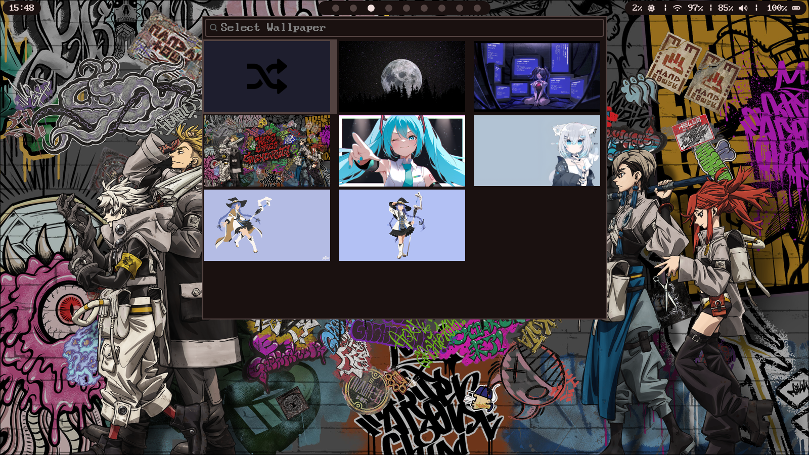
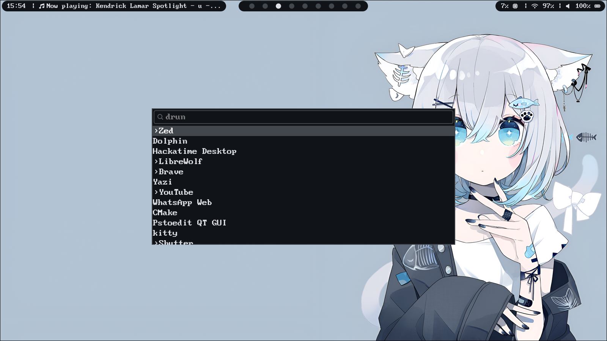

# YummyRice

# Wallpaper-Driven Hyprland Rice

> **Change the wallpaper.**  
> **Everything else follows.**


<p>
  
  
  
  
</p>

---

##  Features
-  **Wallpaper selector** as the source of truth
-  **Matugen theming across the entire system**
-   Consistent UI across all components
-   Smooth and responsive, tested on a T430S

---

## Installation
```bash
$ git clone https://github.com/Anthony-Queen/YummyRice
$ cp -r ~/YummyRice/* ~/.config/
```

---
##  Themed Components
- **Hyprland**
- **Waybar**
- **Wofi**
- **Dunst**
- **Wlogout**
- **Kitty**

---

##  Context
Built for **Hack Club’s YSWS Riceathon**.

